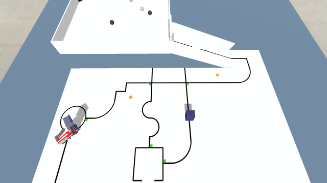

# OBR 2020

## 📚 Introdução

No ano de 2020, devido a pandemia do COVID-19, a Olimpíada Brasileira de Robótica (OBR) foi realizada de forma remota, pela plataforma [sBotics](https://sbotics.net/).

Nesse ano competi por Assis - SP, represetando a [FEMA](https://fema.edu.br/) na equipe FEMA Panzertronic na modalidade prática.

## 🤖 Desafio

O desafio pode ser encontrado nos manuais da etapa [estadual](OBR2020_MP_ManualRegrasSimulacao.pdf) e [nacional](OBR2020_MP_ManualRegrasSIMNacional.pdf).

O código utilizado está no arquivo `FEMA_Panzertronic.sBoticsR`

## 🏅 Resultados

Conseguimos 635 pontos na etapa estadual e ficou em 16º lugar, se classificando para a etapa nacional.

Na etapa nacional, a equipe conseguiu 815 pontos e ficou em 28º lugar.

## 🌐 Links

- [Site da OBR](https://www.obr.org.br/)
- [Canal da Fema Panzertronic](https://www.youtube.com/@equipepanzertronic2389/featured)
- [Vídeo da Etapa Estadual](https://www.youtube.com/watch?v=yELfRDqbBxg&t=106s)
- [Vídeo da Etapa Nacional](https://www.youtube.com/watch?v=sPQFzPoleZA&t=1537s)
- [Classificados para a Etapa Nacional](https://www.obr.org.br/obr-2020-classificados-para-a-etapa-nacional-simulacao/)
- Notícias:
- - <https://www.assiscity.com/educacao/equipe-de-robotica-da-fema-se-classifica-para-etapa-nacional-da-olimpiada-de-robotica-104592.html>
- - <https://vozdovale.com.br/2020/11/10/equipe-de-robotica-da-fema-se-classifica-para-etapa-nacional-da-olimpiada-de-robotica/>
- - <https://diariodeassis.com.br/equipe-da-fema-esta-na-fase-nacional-da-olimpiada-de-robotica/>
- - <https://www.fema.edu.br/index.php/noticias-pagina/1800-robotica-se-classifica-para-etapa-nacional-de-olimpiada>

