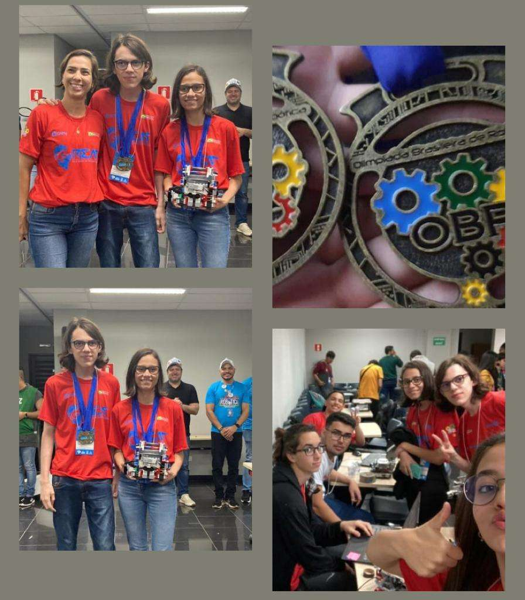

# OBR 2022

## 📚 Introdução

No ano de 2022, voltei a participar da obr presencialmente, dessa vez representando a cidade de Aquidauana - MS, pela equipe Roboseila do laboratório [GREAT](https://instagram.com/lab_great?igshid=MmU2YjMzNjRlOQ==) do [IFMS](https://ifms.edu.br/).

## 🤖 Desafio

O desafio pode ser encontrado nos manuais da etapa [estadual](OBR2022_MP_ManualRegrasRegionalEstadual.pdf).

O código utilizado está no arquivo `roboseila_obr_estadual2022.ev3`

## 🏅 Resultados

Conseguimos 608 pontos na etapa estadual e ficou em 3º lugar.

## 🌐 Links

- [Site da OBR](https://www.obr.org.br/)

