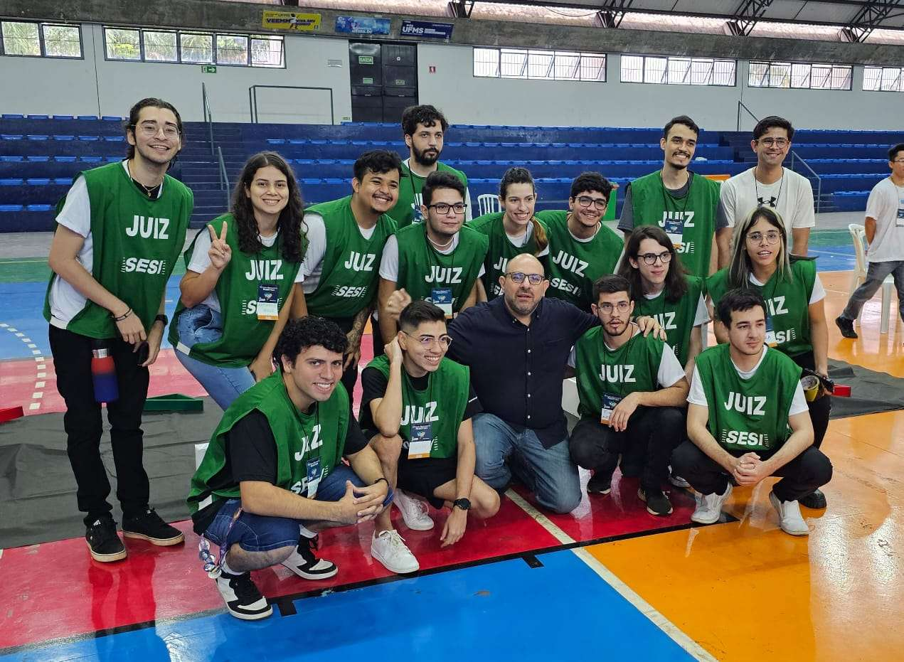

# OBR 2023

## 📚 Introdução

Como eu ingressei a faculdade no ano de 2023, não pude participar da OBR 2023.

Então fui como juíz! Foi uma experiência incrível, e pude ver o outro lado da competição.

Ajudei a organizar a etapa estadual do MS, que foi organizada na [UFMS](https://www.ufms.br/)

## 🤖 Desafio

O desafio pode ser encontrado nos manuais da etapa [estadual](OBR2023_MP_ManualRegrasRegionalEstadual.pdf).

## 🌐 Links

- [Site da OBR](https://www.obr.org.br/)
- Notícias:
- - <https://globoplay.globo.com/v/11897325/>
- - <https://youtu.be/Q7MC689qd6Q?feature=shared>

