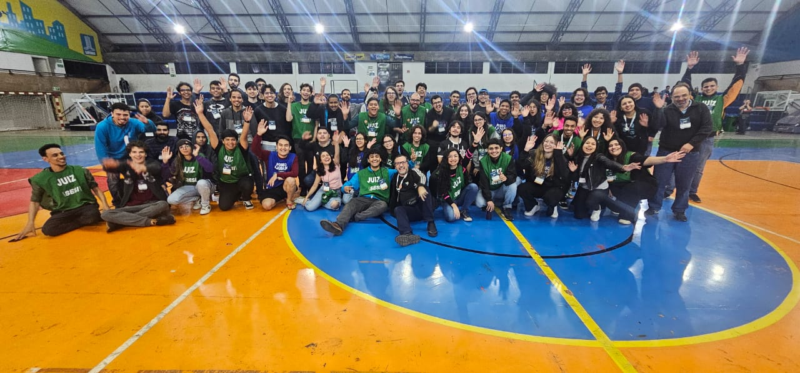

# OBR 2024

## 📚 Introdução

Participei pela segunda vez como juíz da modalidade resgate da OBR, e foi uma experiência incrível novamente.

Esse ano também tivemos a estreia da modalidade artística, que foi muito legal de ver.

Ajudei a organizar a etapa estadual do MS, que foi organizada novamente na [UFMS](https://www.ufms.br/)

Além de juíz, esse ano tive a responsabilidade de montar todas as arenas da etapa estadual, o que foi uma oportunidade única
e muito satisfatória.

Até dei uma entrevista para o SBT 😱

## 📸 Arenas

As arenas foram montadas utilizando [essa ferramenta](https://osaka.rcj.cloud/service/editor/line/2024) e podem ser encontradas [aqui](arenas).

## 🤖 Desafio

As regras da modalidade resgate podem ser encontradas em [resgate](REGRAS-RESGATE.pdf). 
As regras da modalidade artística podem ser encontradas em [artística](REGRAS-ARTISTICA.pdf).

## 🌐 Links

- [Site da OBR](https://www.obr.org.br/)
- Notícias:
- - <https://www.ufms.br/cidade-universitaria-sedia-etapa-estadual-da-olimpiada-brasileira-de-robotica/#:~:text=A%20Cidade%20Universit%C3%A1ria%20sedia%20a,completa%20pode%20ser%20acessada%20aqui.>
- - <https://youtu.be/1bViLO2zMXA?feature=shared>
- - <https://youtu.be/0_wEU5KqKCQ?si=lB_G6AeaabQeLsjB>
    
